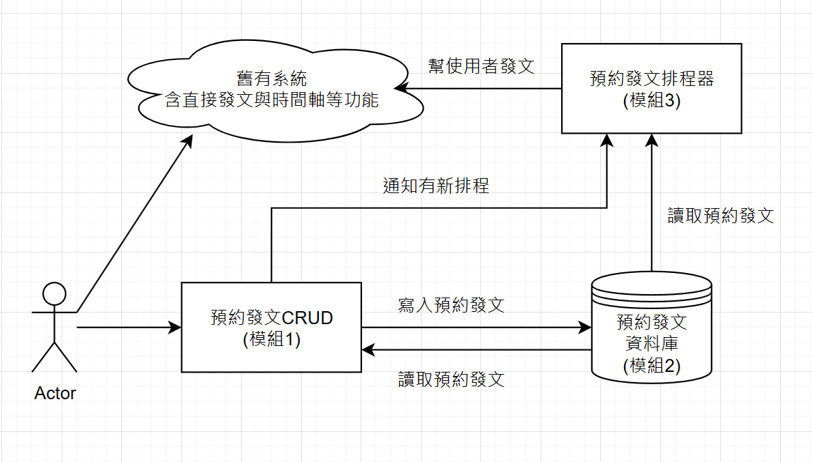

# 架構



此為簡易設計之架構圖

目標：目前已有直接發文、時間軸等功能。想要額外加入預約發文系統。

簡易說明：使用者可以透過模組1預約發文，這些資料會被存入預約發文資料庫(模組2)當中。有一個預約發文的排程器(模組3)，會定時去撈即將到來的預約發文，並把預約發文送入排程，當時間抵達後便會使用舊有系統發文。

題目的幾個目標

- 除了發文者本人以外，其他人在預約時間前不能看到噗文。
  - 預約噗文不影響舊有噗文系統運作。所以新增一筆預約噗文不會導致其他人看到噗文。發文者本人可以透過模組1直接去查自己的預約噗文。
- 預約時間後，使用者及使用者的好友、粉絲會在自己的時間軸看到噗文。
  - 時間抵達後，預約發文排程器(模組3)會幫你發文，走得是舊有系統。只要原本的系統沒壞，使用者相當於在當下發了一次文，那噗文當然能正常被讀到。
- 在預約時間前，使用者可以選擇取消噗文。
  - 預約時間前，使用者可透過模組1刪除預約噗文，模組1會通知模組2和模組3更改的消息，因此不會發文。
- 預約噗文物件起碼要有以下屬性(下略)
  - 請參看下方預約發文資料庫(模組2)的說明
- 請至少提供下列API(下略)
  - 請參看下方預約發文CRUD(模組1)說明

# 模組1 預約發文 CRUD

Endpoint 請參考 [Module1 OpenAPI](tsp-output/@typespec/openapi3/openapi.Module1.yaml) 檔案，可直接複製貼上至 [Swagger Editor](https://editor.swagger.io/) 。

幾個重點

1. Get API有做分頁系統，雖然噗浪目前狀況只允許20則預約噗文，但題目沒提就當未來會開放。
2. CRUD 不需要提供會員id，由 Server 從登入狀態拿到會員id。
3. 當 CRUD 非本人 or 未登入時，回403 Forbidden (Get / Create僅有未登入)。
4. Create / Update / Delete 除了寫入預約發文資料庫(模組2)以外，還會另行通知預約發文排程器(模組3)。

# 模組2 預約發文資料庫

儲存預約發文的地方，以下為簡易DB Schema

```sql
CREATE TABLE SchedulerPlurk
(
    id      uuid PRIMARY KEY,
    content varchar(360),
    posted  timestamp with time zone,
    user_id varchar(30) references Member (id)
);

CREATE INDEX idx_user_id_posted ON SchedulerPlurk (user_id, posted);
CREATE INDEX idx_posted ON SchedulerPlurk (posted);
```

建立了兩種index

1.  (user_id, posted)

使用者想看自己的預約噗文，需要

`Select \* FROM SchedulerPlurk WHERE user_id = '該user' AND posted > '某時間段'

所以需要 user_id + posted的聯合索引

1. (posted)

排程系統會按照預約的時間段發出噗文，需查找即將到來的預約，因此 posted 需獨立 index。

# 模組3 預約發文排程器

此排程器有兩任務

1. 定時任務a
   1. 每n小時去資料庫搜尋現在~n+1小時內預約發文。
   2. 如果此排程還不存在，將其放入單次任務排程。
2. 單次任務
   1. 即發文，時間到了就往舊有系統打API。
   2. 若發文成功，刪除資料庫裡的預約發文。
   3. 註：不需要刪除資料庫裡未發文成功的噗文，可在前端針對已過去的預約文顯示「失敗」，並引導使用者重新進行排程。

此排程器有額外 Endpoint 提供模組一使用，可參閱 [Module3 OpenAPI](tsp-output/@typespec/openapi3/openapi.Module3.yaml) 檔案。

幾個重點

1. 當新增預約的訊息到來，若時間 > n，則忽略。
2. 當更新預約的訊息到來
   1. 若時間 < n，則更新排程時間。
   2. 若時間 > n，則先查看原排程是否已有，若有則刪除。
3. 當刪除預約的訊息到來，查看原排程是否已有，若有則刪除。

# 容錯能力

模組1為無狀態系統，錯了可直接重啟，或是最初就開多台，不會有什麼問題。

模組2為資料庫，資料庫的replication機制很成熟，單台掛掉問題不大。

模組3有狀態，但若掛掉了重開，可以從資料庫中重新建立排程。

# Scalability

模組1為無狀態系統，可直接開多台。

模組2為資料庫，sharding 機制可按原來噗浪的流程走，針對使用者來決定預約發文要放哪個資料庫。

模組3有狀態，必須確保不重複發文。假設有一千個資料庫。當開一台時，此台負責所有資料庫的排程。開兩台時，第一台負責1到500個資料庫，第二台負責500到1000台資料庫。以此類推，最多可以有一千台幫助排程。當轉換台數時，必須把所有舊的排程器關掉重開，以避免重複發文。

模組1要打到哪台模組3，也需要觀看當下的模組3台數，理想上是直接在模組3前方加load balancer，由load balancer來決定要傳遞到哪台。
