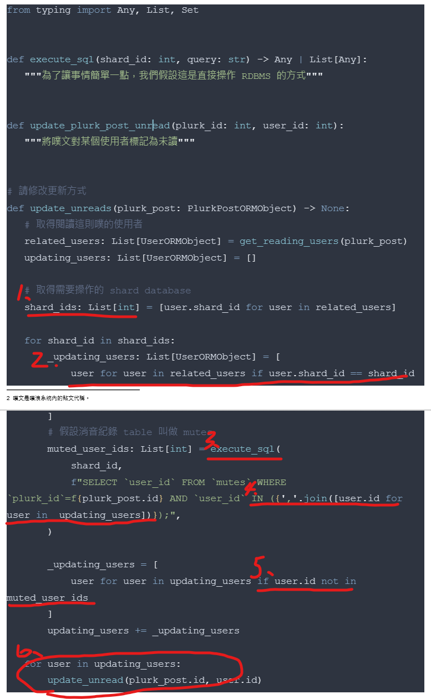

# 問題分析

1. shard_ids 用 list 裝，沒考慮到重複的。
2. 每次都要重新iterate related_users，假設 shard_id 長度為 n，related_users 長度為 m，此作法導致 O(nm) 的複雜度，但明明可以 O(m) 就分完。
3. 對不同資料庫的指令使用 blocking api，而非使用 thread 或 coroutine。
4. 直接撈出所有消音用戶就好，比對目前用戶多此一舉
5. 對 list 使用 in，導致 O(n) 複雜度，用 set 可以是 O(1)
6. 我假設消音是操作資料庫，且一樣有做 sharding
    - 同 3. 更新資料庫用 blocking api很沒效率
    - 同一資料庫可以一次完成，不需要分多次改。
    - 同一個 shard 做完就可以直接標為 unread 了，不用等其他 shard 的結果

# 改進後程式碼
不動 DB 的情況下問題已經很多，因此就此部份寫一個版本
請參閱 [mute.py](mute.py)

# 其他改進方式
噗文的消音紀錄要去使用者所屬的 DB 撈，這個作法聽起來很奇怪。除非有一個功能是：使用者可以看到曾經消音噗文的列表，這樣才需要把消音噗文放在使用者所屬 DB。否則直接將消音紀錄作為噗文的一部分是比較好的選擇。

也就是說噗文在哪個資料庫，Mutes Table就在哪個資料庫，如此一來只需要撈一次就好，不必去每個使用者所屬的 db 撈消音紀錄。

